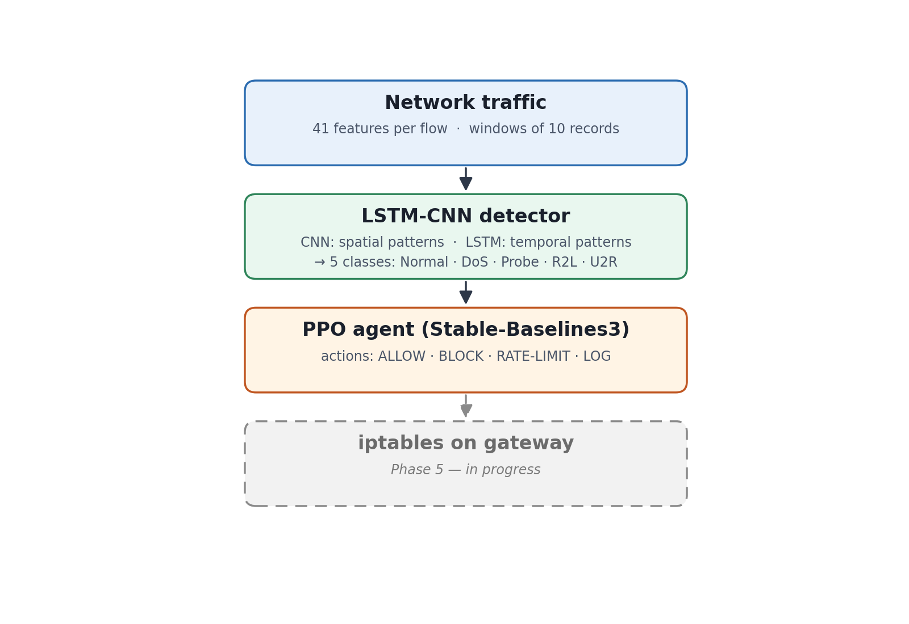
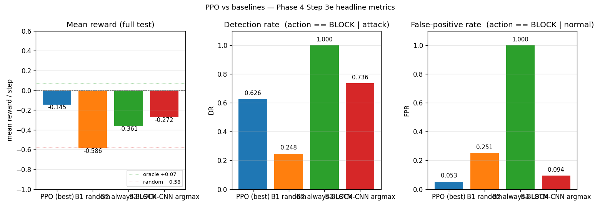
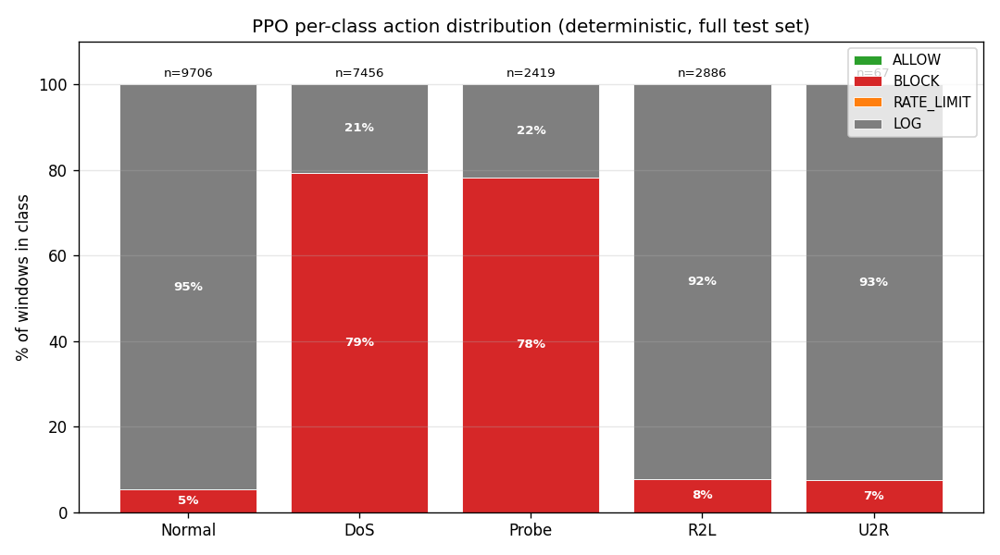

# 🛡️ RL Adaptive Firewall

**An adaptive firewall that learns its own blocking policy, using a hybrid LSTM-CNN traffic classifier and a PPO reinforcement-learning agent.**


> Academic project (PFA), International Institute of Technology (IIT) Sfax, Cybersecurity & Networking (ARSI)

---

## The problem

Traditional firewalls rely on static rules written by hand. When a new attack appears, an administrator has to update the rules manually, which is slow and reactive. Pure ML detectors help, but they only classify traffic. They don't decide **what to do** with it, and they don't weigh the cost of blocking a legitimate user.

## The approach

The firewall is modeled as a **Markov Decision Process**:

| Element | Definition |
|---|---|
| **State** | Detector output computed from a window of 10 flow records × 41 NSL-KDD features |
| **Actions** | `ALLOW` · `BLOCK` · `RATE-LIMIT` · `LOG` |
| **Reward** | Rewards blocking real attacks; penalizes blocking legitimate traffic (false positives) and adds a latency cost |

```
Network traffic (41 features per flow)
        │
        ▼
LSTM-CNN detector ── CNN: spatial patterns · LSTM: temporal patterns
        │   5 classes: Normal · DoS · Probe · R2L · U2R
        ▼
PPO agent (actor-critic, Stable-Baselines3)
        │   chooses ALLOW / BLOCK / RATE-LIMIT / LOG
        ▼
iptables rule on the gateway   ← Phase 5, in progress
```



---

## Results

### Detector (LSTM-CNN, NSL-KDD test set)

| Metric | Value |
|---|---|
| Macro ROC-AUC (one-vs-rest) | **0.90** |
| Accuracy | 77% |
| Macro F1 | 0.66 |
| F1 per class | Normal 0.80 · DoS 0.84 · Probe 0.75 · R2L 0.44 · U2R 0.45 |

### PPO agent vs baselines (full test set, n = 22,534)

| Method | Mean reward ↑ | Detection rate ↑ | False-positive rate ↓ |
|---|---|---|---|
| **PPO (this project)** | **−0.145** | 0.626 | **0.053** |
| B1: random policy | −0.586 | 0.248 | 0.251 |
| B2: always BLOCK | −0.361 | 1.000 | 1.000 |
| B3: LSTM-CNN alone (no RL) | −0.272 | **0.736** | 0.094 |

**Key takeaways**

- PPO beats every baseline on mean reward and has the **lowest false-positive rate** of any non-trivial policy: **44% lower than the detector alone** (5.3% vs 9.4%).
- **The trade-off:** detection rate drops by 11 points (62.6% vs 73.6%). The agent chose to block fewer legitimate users at the cost of catching fewer attacks.
- **An uncertainty-aware policy emerged on its own.** The agent blocks aggressively where the detector is reliable (DoS and Probe, about 78–79% BLOCK). Where the detector is weak (R2L and U2R), it falls back to `LOG` about 92% of the time instead of risking false blocks.




---

## Limitations (honest notes)

- **Training data:** NSL-KDD is a classic benchmark but old. R2L and U2R are rare, which explains their weak F1 scores. An attempt to extend training with CIC-IDS2017 did not pass my quality gate, so it was not merged.
- **Oracle reward:** during training and evaluation, the reward is computed from ground-truth labels. A real deployment would need feedback from measured false positives.
- **Single-step decisions:** each flow window is treated as an independent decision.
- **No live traffic yet:** all results above come from offline evaluation on the dataset. Live enforcement is the next phase.

## Project status

| Phase | Description | Status |
|---|---|---|
| 1 | Environment & setup | ✅ Done |
| 2 | Data preprocessing & EDA (NSL-KDD) | ✅ Done |
| 3 | LSTM-CNN detector | ✅ Done |
| 4 | PPO agent + evaluation vs baselines | ✅ Done |
| 5 | Live enforcement: Mininet network + iptables on gateway | 🚧 In progress |

**Next:** a Mininet topology with attackers, victims, benign clients and a gateway; replaying DoS (hping3), Probe (nmap) and brute-force (hydra) attacks; measuring detection rate, false-positive rate, throughput and decision latency.

---

## Repository structure

```
rl-adaptive-firewall/
├── config.py               # paths (set RL_FIREWALL_DATA)
├── requirements.txt
├── notebooks/
│   └── 01_eda.ipynb        # exploration + preprocessing
├── src/
│   ├── models/             # LSTM-CNN detector
│   ├── environment/        # Gymnasium FirewallEnv
│   ├── agent/              # PPO agent + feature extractor
│   └── preprocessing/      # label mapping
├── training/               # train_lstm_cnn.py · train_ppo.py
├── evaluation/             # evaluate_ppo.py (baselines + plots)
└── docs/images/            # figures used in this README
```

## Getting started

```bash
git clone https://github.com/firastrabelsi1412/rl-adaptive-firewall.git
cd rl-adaptive-firewall
python -m venv venv && source venv/bin/activate   # Windows: venv\Scripts\activate
pip install -r requirements.txt
```

1. Download **NSL-KDD** (`KDDTrain+.txt`, `KDDTest+.txt`) from the [official source](https://www.unb.ca/cic/datasets/nsl.html).
2. Set the data folder: `export RL_FIREWALL_DATA=/path/to/data`
3. Run `notebooks/01_eda.ipynb` to generate the processed arrays.
4. Train the models:
   ```bash
   python training/train_lstm_cnn.py
   python training/train_ppo.py
   python evaluation/evaluate_ppo.py
   ```

## Tech stack

Python 3.10 · PyTorch · Stable-Baselines3 (PPO) · Gymnasium · scikit-learn · NumPy / pandas · Matplotlib · TensorBoard · *(Phase 5)* Mininet · iptables · Scapy

---

## Author

**Firas Trabelsi**, Cybersecurity & Networking engineering student, IIT Sfax
[LinkedIn](https://www.linkedin.com/in/firastrabelsi) · Looking for a PFE (2027) in cybersecurity

## License

MIT
